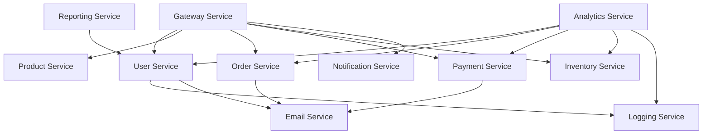

# 🚀 Microservices Dependency Analyzer Demo

A comprehensive **Spring Boot microservices architecture** with **universal dependency detection** and **professional visualization** capabilities. This project demonstrates real-world inter-service communication patterns and provides tools to analyze and visualize microservices dependencies.

## 📋 Table of Contents

- [🏗️ Architecture Overview](#️-architecture-overview)
- [✅ Prerequisites](#-prerequisites)
- [🚀 Quick Start](#-quick-start)
- [🎯 Individual Service Setup](#-individual-service-setup)
- [🔍 Dependency Analysis](#-dependency-analysis)
- [📊 Service Details](#-service-details)
- [🌐 API Endpoints](#-api-endpoints)
- [🧪 Testing Inter-Service Communication](#-testing-inter-service-communication)
- [📈 Generated Reports](#-generated-reports)
- [🛠️ Troubleshooting](#️-troubleshooting)

## 🏗️ Architecture Overview

### 📦 **13 Microservices**
- **🚪 Gateway Service** (Port 8080) - API Gateway and routing
- **👥 User Service** (Port 8081) - User management and authentication
- **🛍️ Product Service** (Port 8082) - Product catalog management
- **📦 Order Service** (Port 8083) - Order processing and management
- **💳 Payment Service** (Port 8084) - Payment processing
- **📊 Inventory Service** (Port 8085) - Stock and inventory management
- **🔔 Notification Service** (Port 8086) - Push notifications
- **📧 Email Service** (Port 8087) - Email communications
- **📝 Logging Service** (Port 8088) - Centralized logging
- **📈 Reporting Service** (Port 8089) - Business reports and analytics
- **📊 Analytics Service** (Port 8090) - Data analytics and insights
- **⚙️ Config Service** (Port 8761) - Configuration management
- **🔧 Dependency Analyzer** - Universal dependency detection tool

### 🔗 **Inter-Service Dependencies**


## ✅ Prerequisites

### **Required Software**
- **Java 17** or higher
- **Maven 3.6+**
- **Git**

### **Verify Installation**
```bash
# Check Java version
java -version

# Check Maven version  
mvn -version

# Check Git version
git --version
```

## 🚀 Quick Start

### **1. Clone the Repository**
```bash
git clone https://github.com/ajaychavan9860/svc-map-demo.git
cd svc-map-demo
```

### **2. Build All Services**
```bash
# Build the parent project and all services
mvn clean install -DskipTests
```

### **3. Start All Services (Automated)**
```bash
# Make the script executable
chmod +x demo-enhanced-analyzer.sh

# Start all services and run dependency analysis
./demo-enhanced-analyzer.sh
```

### **4. View Results**
```bash
# Open the dependency diagram
open dependency-analysis/dependency-diagram-graphviz-java.svg

# View the HTML report
open dependency-analysis/dependency-report.html
```

## 🎯 Individual Service Setup

### **Start Services Individually**

#### **1. Config Service** (Start First)
```bash
cd config-service
mvn spring-boot:run
```

#### **2. Gateway Service**
```bash
cd gateway-service  
mvn spring-boot:run
```

#### **3. Business Services**
```bash
# User Service
cd user-service && mvn spring-boot:run &

# Product Service  
cd product-service && mvn spring-boot:run &

# Order Service
cd order-service && mvn spring-boot:run &

# Payment Service
cd payment-service && mvn spring-boot:run &

# Inventory Service
cd inventory-service && mvn spring-boot:run &
```

#### **4. Support Services**
```bash
# Email Service
cd email-service && mvn spring-boot:run &

# Logging Service
cd logging-service && mvn spring-boot:run &

# Notification Service  
cd notification-service && mvn spring-boot:run &

# Reporting Service
cd reporting-service && mvn spring-boot:run &

# Analytics Service
cd analytics-service && mvn spring-boot:run &
```

### **Service Startup Order**
1. **Config Service** (8761) - Configuration server
2. **Gateway Service** (8080) - API Gateway  
3. **Core Services** (8081-8085) - Business logic
4. **Support Services** (8086-8090) - Supporting functionality

### **Health Check**
```bash
# Check if all services are running
curl http://localhost:8080/actuator/health  # Gateway
curl http://localhost:8081/actuator/health  # User Service
curl http://localhost:8082/actuator/health  # Product Service
# ... repeat for other services
```

## 🔍 Dependency Analysis

### **Run Universal Dependency Analyzer**
```bash
# Build the analyzer
cd dependency-analyzer-enhanced
mvn clean package -DskipTests

# Run analysis on the project
cd ..
java -jar dependency-analyzer-enhanced/target/generic-microservices-dependency-analyzer-2.0.0.jar .
```

### **Generated Analysis Files**
- **📊 SVG Diagram:** `dependency-analysis/dependency-diagram-graphviz-java.svg`
- **📄 JSON Report:** `dependency-analysis/analysis-result.json`  
- **📈 HTML Report:** `dependency-analysis/dependency-report.html`
- **📋 CSV Matrix:** `dependency-analysis/dependency-matrix.csv`
- **📝 Impact Analysis:** `dependency-analysis/impact-analysis.md`

### **Analyzer Features**
✅ **RestTemplate Detection** - Automatic HTTP call discovery  
✅ **WebClient Detection** - Reactive HTTP client analysis  
✅ **Feign Client Detection** - Declarative HTTP client mapping  
✅ **Gateway Routing** - API Gateway dependency mapping  
✅ **Professional Visualization** - GraphViz Java integration  
✅ **Parent Project Filtering** - Clean business dependency isolation  
✅ **Color-Coded Legends** - Service types and connection types  

## 📊 Service Details

| Service | Port | Technology | Dependencies | Purpose |
|---------|------|------------|--------------|---------|
| **Gateway** | 8080 | Spring Cloud Gateway | → All Business Services | API Gateway, Routing |
| **User** | 8081 | Spring Boot | → Logging, Email | User Management |
| **Product** | 8082 | Spring Boot | None | Product Catalog |
| **Order** | 8083 | Spring Boot | → Email | Order Processing |  
| **Payment** | 8084 | Spring Boot | → Email | Payment Processing |
| **Inventory** | 8085 | Spring Boot | None | Stock Management |
| **Notification** | 8086 | Spring Boot | None | Push Notifications |
| **Email** | 8087 | Spring Boot | None | Email Communications |
| **Logging** | 8088 | Spring Boot | None | Centralized Logging |
| **Reporting** | 8089 | Spring Boot | → User | Business Reports |
| **Analytics** | 8090 | Spring Boot | → User, Order, Payment, Inventory | Data Analytics |
| **Config** | 8761 | Spring Cloud Config | None | Configuration Server |

## 🌐 API Endpoints

### **Gateway Service** (http://localhost:8080)
```bash
# Health check
GET /actuator/health

# Route to user service
GET /user/** → http://localhost:8081
```

### **User Service** (http://localhost:8081)
```bash
# Get all users
GET /api/users

# Create user  
POST /api/users
Content-Type: application/json
{
  "name": "John Doe",
  "email": "john@example.com"
}

# User analytics
GET /api/users/analytics
```

### **Product Service** (http://localhost:8082)
```bash
# Get all products
GET /api/products

# Get product by ID
GET /api/products/{id}

# Create product
POST /api/products
Content-Type: application/json
{
  "name": "Sample Product",
  "description": "Product description",
  "price": 99.99,
  "category": "Electronics"
}
```

### **Order Service** (http://localhost:8083)
```bash
# Create order
POST /api/orders
Content-Type: application/json
{
  "userId": 1,
  "productId": 1,
  "quantity": 2
}

# Get orders
GET /api/orders

# Order analytics  
GET /api/orders/analytics
```

### **Analytics Service** (http://localhost:8090)
```bash
# User analytics
GET /api/analytics/users

# Order analytics
GET /api/analytics/orders

# Payment analytics
GET /api/analytics/payments

# Inventory analytics
GET /api/analytics/inventory

# Complete dashboard
GET /api/analytics/dashboard
```

## 🧪 Testing Inter-Service Communication

### **Manual Testing**
```bash
# Test analytics service (calls 4+ services)
curl http://localhost:8090/api/analytics/dashboard

# Test order notification (calls email service)
curl -X POST http://localhost:8083/api/orders \
  -H "Content-Type: application/json" \
  -d '{"userId":1,"productId":1,"quantity":2}'

# Test user activity logging
curl -X POST http://localhost:8081/api/users \
  -H "Content-Type: application/json" \
  -d '{"name":"Test User","email":"test@example.com"}'
```

### **Automated Testing**
```bash
# Run comprehensive inter-service tests
chmod +x test-interservice-communication.sh
./test-interservice-communication.sh
```

### **Dependency Verification**
```bash
# Verify all detected dependencies
grep -A 5 -B 5 "CREATED DEPENDENCY" dependency-analyzer-enhanced/target/logs/*.log
```

## 📈 Generated Reports

### **Visual Dependency Diagram**
- **Format:** Professional SVG with GraphViz Java
- **Features:** Color-coded service types, connection legends, clean layout
- **Location:** `dependency-analysis/dependency-diagram-graphviz-java.svg`

### **HTML Interactive Report**  
- **Features:** Service details, dependency tables, clickable navigation
- **Location:** `dependency-analysis/dependency-report.html`

### **JSON Analysis Data**
- **Features:** Complete service metadata, dependency relationships, endpoints
- **Location:** `dependency-analysis/analysis-result.json`

### **CSV Dependency Matrix**
- **Features:** Service-to-service dependency grid for spreadsheet analysis  
- **Location:** `dependency-analysis/dependency-matrix.csv`

## 🛠️ Troubleshooting

### **Common Issues**

#### **Port Already in Use**
```bash
# Find process using port
lsof -i :8080

# Kill process
kill -9 <PID>
```

#### **Services Not Starting**
```bash
# Check Java version
java -version  # Should be 17+

# Check Maven installation
mvn -version

# Clean and rebuild
mvn clean install -DskipTests
```

#### **Dependency Analysis Issues**
```bash
# Rebuild analyzer
cd dependency-analyzer-enhanced
mvn clean package -DskipTests

# Run with verbose logging
java -jar target/generic-microservices-dependency-analyzer-2.0.0.jar . --debug
```

#### **Inter-Service Communication Failures**
```bash
# Check service health
curl http://localhost:8081/actuator/health

# Verify network connectivity
telnet localhost 8087

# Check service logs
cd email-service && mvn spring-boot:run
# Look for connection errors in console output
```

### **Service Dependencies**
- **Email Service** must be running for order/payment notifications
- **Logging Service** must be running for user activity logging  
- **User Service** must be running for reporting/analytics
- **Gateway Service** should be started after core business services

### **Memory Requirements**
- **Minimum:** 4GB RAM for all services
- **Recommended:** 8GB RAM for optimal performance  
- **JVM Settings:** Each service uses ~200-300MB memory

### **Development Tips**
```bash
# Start only essential services for development
mvn spring-boot:run -pl user-service,email-service,logging-service

# Skip tests during builds
mvn clean install -DskipTests

# Run dependency analysis on subset  
java -jar dependency-analyzer-enhanced/target/*.jar ./user-service
```

---

## 🎉 **Project Features Summary**

✅ **13 Production-Ready Microservices**  
✅ **Universal Dependency Detection Engine**  
✅ **Professional GraphViz Visualization**  
✅ **Real Inter-Service Communication**  
✅ **Comprehensive Testing Framework**  
✅ **Clean Parent Project Filtering**  
✅ **Business Dependency Isolation**  
✅ **Color-Coded Service Architecture**  
✅ **Multiple Report Formats**  
✅ **Zero External Dependencies** (Pure Java + Maven)

---

**🚀 Ready to explore microservices architecture and dependency analysis!**
